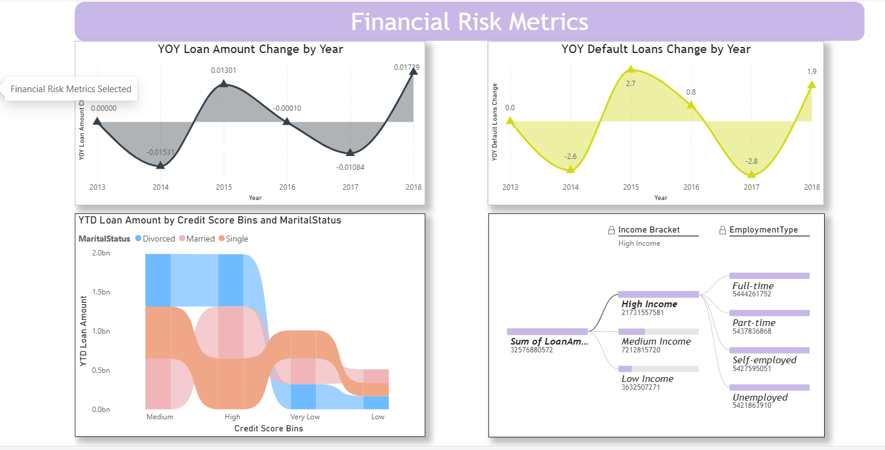

# Loan Default Risk Analysis Dashboard

### Dashboard Link: restricted Power BI Access

---

## Problem Statement

This dashboard helps financial institutions analyze loan distribution, customer profiles, and default risk patterns. It enables better decision-making by identifying high-risk segments and understanding key factors such as income, employment, and credit score.

---

## Steps followed

- Step 1: Loaded dataset into Power BI Desktop (CSV file)

- Step 2: Opened Power Query Editor and enabled:
  - Column distribution  
  - Column quality  
  - Column profile  

- Step 3: Applied data cleaning and handled missing values

- Step 4: Created calculated column for age grouping

Age Group =
IF([Age] <= 25, "0-25",
IF([Age] <= 50, "25-50",
IF([Age] <= 75, "50-75",
"75+")))

- Step 5: Created measures for analysis

Total Loan Amount = SUM([Loan Amount])

Average Loan = AVERAGE([Loan Amount])

Default Rate % =
DIVIDE(SUM([Default Cases]), COUNT([Loan ID])) * 100

- Step 6: Built visuals:
  - Loan amount by purpose  
  - Income by employment  
  - Default rate by employment  
  - Loan amount by age group  
  - Default trend by year  

- Step 7: Created multiple report pages:
  - Loan Default & Overview  
  - Applicant Demographics  
  - Financial Risk Metrics  

- Step 8: Added slicers for interactivity

- Step 9: Published report to Power BI Service

---

## Snapshot of Dashboard

### Loan Default & Overview

### Applicant Demographics & Financial Profile

### Financial Risk Metrics

---

## Insights

### [1] Loan Distribution
- Highest loan amounts observed in home and business categories

### [2] Employment Analysis
- Full-time employees have higher income  
- Unemployed individuals show highest default rates  

### [3] Credit Score Impact
- Medium credit score segment dominates loan distribution  

### [4] Age Group Analysis
- Adults receive highest loan amounts  
- Teen group has lowest  

### [5] Risk Trends
- Default rates fluctuate year over year  

---

## Conclusion

This dashboard helps identify high-risk customers and improves loan decision strategies by providing insights into financial behavior and default trends.

---

## Tools Used

- Power BI  
- DAX  
- Data Modeling  
- Data Visualization  
